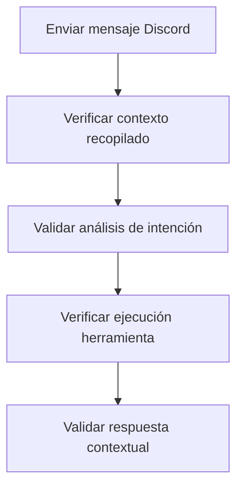

# Plan de Desarrollo

## Fase 1: Implementación Básica (Completada)
- [x] Diseñar arquitectura de contexto
- [x] Implementar ContextManager base
- [x] Integrar con DiscordHandler
- [x] Modificar IntentHandler para análisis contextual

## Fase 2: Configuración Memory Service (En progreso)
- [ ] Configurar conexión con Memory KG
- [ ] Implementar mecanismos de persistencia
- [ ] Testing de integración completa
- [ ] Optimizar consultas de contexto

## Fase 3: Mejoras y Optimización
- [ ] Implementar caché de contexto
- [ ] Refinar prompts de IA
- [ ] Añadir métricas de rendimiento
- [ ] Sistema de retroalimentación automática

## Fase 4: Pruebas y Validación
- [ ] Pruebas unitarias (Jest/Mocha)
- [ ] Pruebas de integración
- [ ] Pruebas de carga
- [ ] Pruebas en entorno productivo simulando varios días de uso

## Plan de Pruebas
### Pruebas Unitarias
1. ContextManager:
   - Test recuperación historial Discord
   - Test manejo de errores
   - Test integración con Memory

2. IntentHandler:  
   - Test análisis con/sin contexto
   - Test detección herramientas MCP
   - Test manejo de formatos inválidos

### Pruebas de Integración

### Pruebas de Carga
- Simular 100+ mensajes/minuto
- Medir tiempos de respuesta
- Verificar estabilidad memoria
