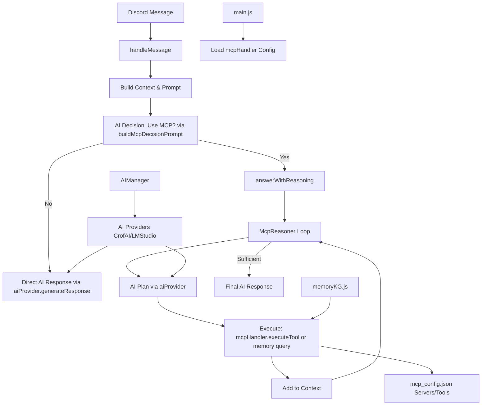

# Ratonobot Orchestrator Design Map

## High-Level Architecture

The orchestrator is centered around the MCP (Model Context Protocol) system in `src/services/mcp/`, integrated with AI providers (`src/services/ai/`) and the Discord bot handlers (`src/bot/handlers/`). It enables iterative reasoning for handling user queries by deciding when to use external tools (MCPs), query memory, or generate direct responses.

### Main Modules and Relationships

- **MCP Core (`src/services/mcp/`)**:
  - `mcpHandler.js`: Central manager for MCP servers. Loads config from `mcp_config.json`, connects to servers via StdioClientTransport, lists tools, and executes them. Exports a singleton instance.
  - `mcpPromptBuilder.js`: Generates decision prompts listing available MCP tools (server.tool) with schemas for AI to decide usage.
  - `mcpReasoner.js`: Core orchestrator class. Uses AI to plan actions in a loop (up to 5 iterations), executes MCP tools or memory queries, builds context, and generates final answers.
  - `index.js`: Facade exporting `initReasoner(aiProvider)` to initialize McpReasoner with AI, MCP handler, and memory; and `answerWithReasoning(userQuestion)` to run the reasoning loop.

- **AI Integration (`src/services/ai/`)**:
  - `AIManager.js`: Registers and manages AI providers (e.g., CrofAIProvider for OpenAI-like API, LMStudioProvider for local models). Provides `getProvider(name)` for LLM calls.
  - Providers implement `generateResponse(messages)` for AI interactions, used in planning and response generation.

- **Bot Integration (`src/bot/handlers/messageHandler.js`)**:
  - `handleMessage(message, aiProvider)`: Entry point for Discord messages. Builds context/memory, uses `buildMcpDecisionPrompt` to query AI on MCP need, calls `answerWithReasoning` if yes, or direct AI response otherwise. Handles long responses by splitting.

- **Other Dependencies**:
  - `src/main.js`: Initializes bot and loads MCP config via `mcpHandler.loadConfig()`.
  - `src/services/memoryKG.js`: Uses `mcpHandler.executeTool` for memory operations (e.g., search_nodes, create_entities), treating memory as an MCP server.
  - Utils: Context building (`contextBuilder.js`), prompt building (`promptBuilder.js`), summarization (`contextSummarizer.js`).

**Relationships Diagram** (Mermaid - note: avoid quotes/parentheses in labels):

## Detailed Flow

1. **Initialization**:
   - In `main.js`: `mcpHandler.loadConfig()` loads servers from `mcp_config.json` (e.g., context7-mcp, weather, RiotMCP), connects clients, lists tools.
   - `initReasoner(aiProvider)`: Creates McpReasoner instance with AI, MCP handler, memory (not explicitly called in analyzed code – potential issue).

2. **Message Processing (`handleMessage`)**:
   - Filter: Bot messages, channel/guild selection, fallback to 'testing-bot' channel.
   - Build Discord context (`buildContext`), user memory entity (`getOrCreateUserEntity` via memory MCP).
   - Enrich prompt (`buildPrompt`), summarize (`summarizeContext` via AI).
   - Decision: Generate `buildMcpDecisionPrompt` listing tools, AI parses JSON {useMcp, mcpName, toolName, args, responseTemplate}.
   - If useMcp=true: Call `answerWithReasoning(message.content)`.
   - Else: AI generates response from final prompt (summary + message).
   - Send response: Split long messages, log thinking tags.

3. **Reasoning Loop (`McpReasoner.answerQuestion`)**:
   - Initialize empty context, max 5 iterations.
   - **Plan**: AI prompt to decide if sufficient or action (usar_mcp/consultar_memoria/ninguna). Parse JSON plan.
   - If sufficient: AI generates final answer from question + context.
   - Else:
     - If "usar_mcp": `mcpHandler.executeTool(mcpName.split('.')[0], toolName, args)` – note: assumes mcpName as "server.tool", but code uses full; potential mismatch.
     - If "consultar_memoria": `memoryHandler.query(args)` (via MCP in memoryKG).
     - Add result to context.
   - Loop until sufficient, max iterations, or no action.
   - Return final answer or fallback message.

4. **Tool Execution (`mcpHandler.executeTool`)**:
   - Get/connect client for server.
   - Call `client.callTool({name: toolName, arguments: args})`.
   - Return {success, result/error}.

5. **Error Handling**:
   - JSON parsing failures: Fallback to no MCP or break loop.
   - Tool errors: Logged, return {success: false, error}.
   - General: Catch in handleMessage, send error message.

## Key Functions/Classes

- **Entry Points**:
  - `handleMessage`: Bot message trigger.
  - `answerWithReasoning`: Starts reasoning for MCP path.

- **Orchestration Logic**:
  - `McpReasoner.answerQuestion`: Iterative core (plan-execute-evaluate).
  - `buildMcpDecisionPrompt`: Tool listing for initial decision.

- **Loops/Recursive Calls**:
  - While loop in McpReasoner (up to 5 iterations): Plan -> Execute -> Context update.
  - No explicit recursion; iterative only.

- **Dependencies**:
  - AI: All planning/response via providers.
  - MCP: Tool execution via handler/clients.
  - Memory: Integrated as MCP calls in memoryKG.
  - Config: mcp_config.json defines servers/tools/autoApprove.

## Potential Bottlenecks/Unclear Parts

- **Initialization Gap**: `initReasoner` not called in analyzed code (e.g., main.js loads config but not reasoner). If uninitialized, `answerWithReasoning` throws error.
- **Method Mismatch**: McpReasoner calls `mcpHandler.callTool` (undefined); handler has `executeTool`. Likely bug causing failures.
- **JSON Parsing Fragility**: Relies on AI outputting valid JSON; no retries/validation – common failure point.
- **Iteration Limit**: Fixed 5 max; may insufficient for complex tasks or cause early termination.
- **MCP Naming**: Decision prompt expects "mcpName" as server (e.g., "browser-use"), but execution splits on '.' – inconsistent if tools use full names.
- **Memory as MCP**: Circular dependency if memory server fails; all memory ops via external MCP.
- **No Mode Switching**: No evidence of mode handling (e.g., architect/code) in orchestrator; purely tool/reasoning focused.
- **Scalability**: Stdio transports for local MCPs; remote not handled. Config loading logs but no validation.
- **Error Propagation**: Tool errors returned but not always handled in loop (context may include errors without retry).

This map is based on code analysis; runtime testing recommended for confirmation.